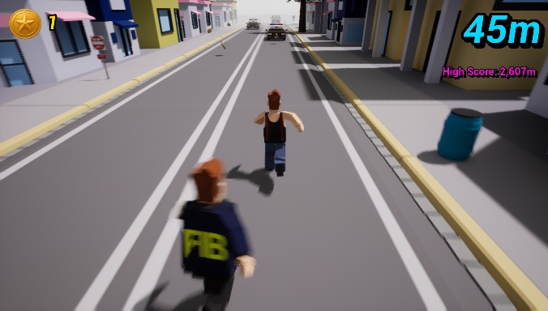
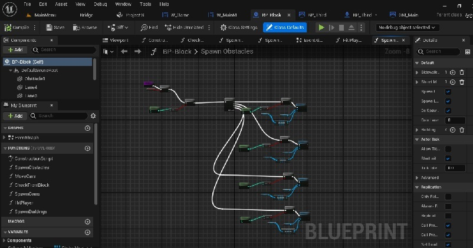
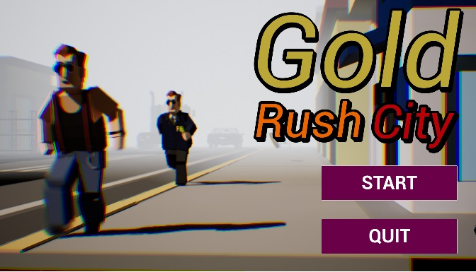

# 🏃‍♂️ Gold Rush City

-blue)

**Gold Rush City** es un prototipo de "Infinite Runner" de alta velocidad desarrollado en Unreal Engine 5. El proyecto demuestra la implementación de mecánicas de generación procedural de niveles, optimización de recursos en tiempo real y lógica de juego a través de Visual Scripting (Blueprints).

---

## 🚀 Características Técnicas

### 1. Generación Procedural (Level Streaming)
El juego no utiliza un mapa estático infinito. En su lugar, implementa un sistema de **spawning dinámico** de "tiles" (tramos de nivel) que se generan frente al jugador y se destruyen al quedar atrás.
* **Beneficio:** Mantiene el uso de memoria RAM estable y bajo, permitiendo que el juego corra indefinidamente sin caídas de rendimiento.

### 2. Lógica en Blueprints
Toda la jugabilidad fue programada utilizando el sistema de nodos de UE5.
* **Player Controller:** Manejo de Inputs, física de salto, deslizamiento (slide) y detección de colisiones.
* **Game Loop:** Gestión de estados de juego (Menú -> Run -> Game Over -> Restart).
* **Score System:** Cálculo de puntaje basado en distancia y recolección de items.

*(Vista de la lógica interna del controlador del personaje)*

### 3. Interfaz de Usuario (UMG)
Implementación de Widgets para el HUD y menús interactivos.
* Menú Principal con navegación.
* HUD en tiempo real (Puntaje/Distancia).

---

## 🎮 Controles

* **W / Flecha Arriba / Espacio:** Saltar.
* **S / Flecha Abajo:** Deslizarse (Slide).
* **A / D / Flechas Laterales:** Moverse entre carriles.

---

## 📥 Descarga e Instalación

Este proyecto ha sido empaquetado como un ejecutable standalone para Windows.

1.  Ve a la sección de **[Releases](../../releases)** de este repositorio.
2.  Descarga el archivo `.zip` de la última versión (v1.0).
3.  Descomprime el archivo.
4.  Ejecuta `GoldRushCity.exe`.

*(Nota: Al ser un ejecutable no firmado, Windows podría pedir confirmación para ejecutarlo. Es seguro).*

---

> **Autor:** Raúl Héctor Cámara Carreón
>
> *Desarrollado como parte del portafolio de Desarrollo de Videojuegos y Lógica Computacional.*
